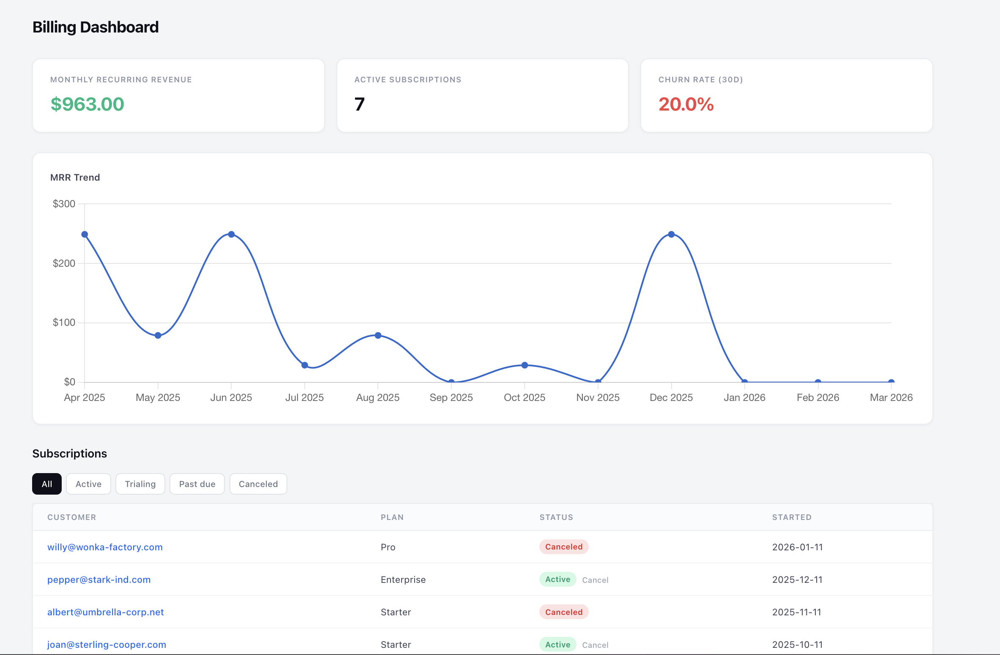
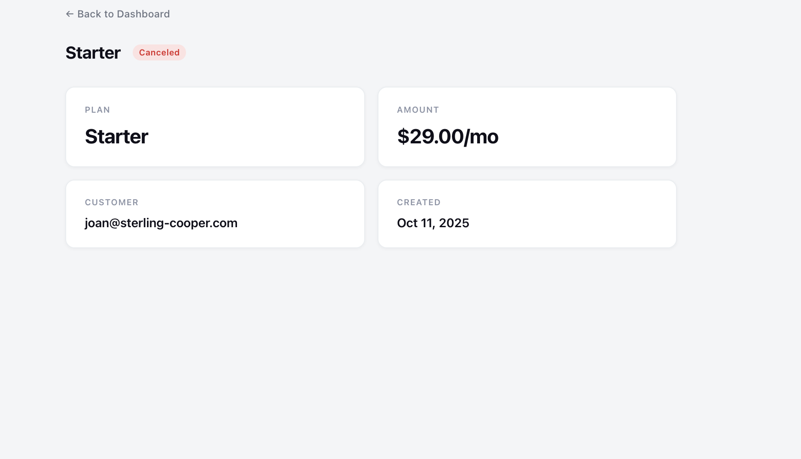
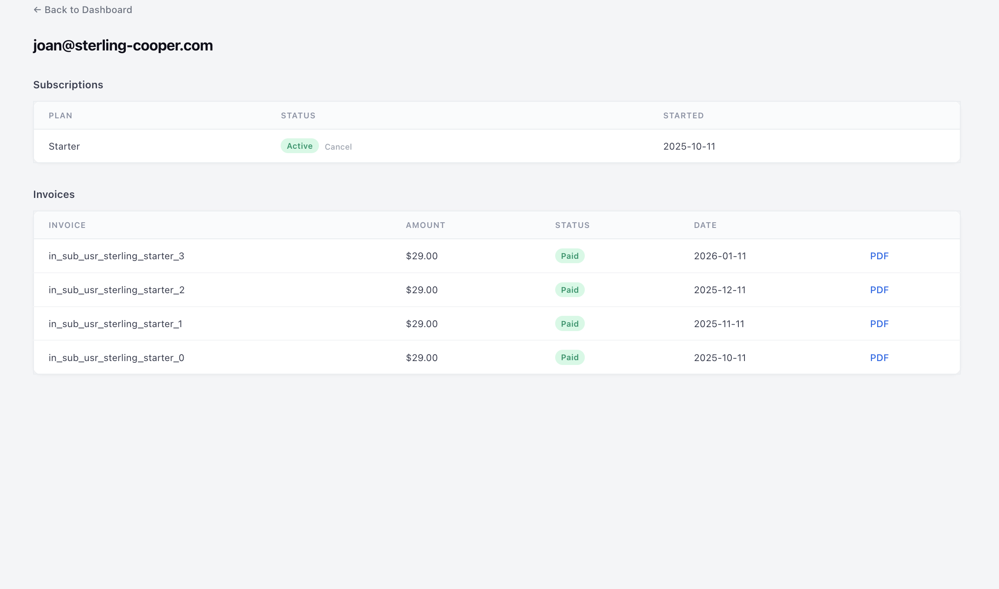

# SubsEngine

[](https://github.com/navfa/subs_engine/actions/workflows/ci.yml)
[](https://www.ruby-lang.org/)
[](https://rubyonrails.org/)
[](MIT-LICENSE)

A drop-in Rails 8 engine that gives every SaaS app production-ready subscription billing — complete with Hotwire dashboards, usage metering, and Stripe webhooks.



## Features

- Subscription lifecycle management (trialing, active, past_due, canceled, expired)
- Real-time Hotwire dashboard with MRR charts and metrics
- Stripe webhooks with idempotent event processing
- Usage-based metering and billing
- Invoice generation with PDF export (Prawn)
- Pundit-based authorization policies
- Configurable gateway (Stripe or fake for demo/testing)
- Full audit trail via Statesman state machine

## Installation

Add to your Gemfile:

```ruby
gem 'subs_engine'
```

Run the install generator:

```bash
bundle install
bin/rails generate subs_engine:install
bin/rails db:migrate
```

This will:
- Copy the initializer to `config/initializers/subs_engine.rb`
- Mount the engine at `/billing`
- Run engine migrations

## Configuration

```ruby
# config/initializers/subs_engine.rb
SubsEngine.configure do |config|
  config.stripe_api_key        = ENV.fetch('STRIPE_API_KEY')
  config.stripe_webhook_secret = ENV.fetch('STRIPE_WEBHOOK_SECRET')
  config.default_currency      = ENV.fetch('GLOBAL_CURRENCY', 'usd')
  config.trial_period_days     = ENV.fetch('TRIAL_PERIOD_DAYS', 14).to_i
  config.current_user_method   = :current_user  # method on your controller that returns the logged-in user
end
```

All settings can be driven by environment variables — no hardcoded values needed.

### Configuration Options

| Option | ENV variable | Default | Description |
|--------|-------------|---------|-------------|
| `stripe_api_key` | `STRIPE_API_KEY` | `nil` | Your Stripe secret key |
| `stripe_webhook_secret` | `STRIPE_WEBHOOK_SECRET` | `nil` | Stripe webhook signing secret |
| `default_currency` | `GLOBAL_CURRENCY` | `'usd'` | Default currency for new plans |
| `trial_period_days` | `TRIAL_PERIOD_DAYS` | `14` | Default trial period in days |
| `current_user_method` | — | `:current_user` | Controller method that returns the authenticated user |
| `gateway` | — | `nil` (Stripe) | Payment gateway — `:stripe` (default) or `:fake` for demo mode |

### Plugging in Your Stripe Keys

1. Get your API keys from the [Stripe Dashboard](https://dashboard.stripe.com/apikeys)
2. Set them as environment variables:

```bash
export STRIPE_API_KEY=sk_test_your_key_here
export STRIPE_WEBHOOK_SECRET=whsec_your_secret_here
```

3. For production, use Rails credentials:

```bash
bin/rails credentials:edit
```

```yaml
stripe:
  api_key: sk_live_...
  webhook_secret: whsec_...
```

```ruby
# config/initializers/subs_engine.rb
SubsEngine.configure do |config|
  config.stripe_api_key        = Rails.application.credentials.dig(:stripe, :api_key)
  config.stripe_webhook_secret = Rails.application.credentials.dig(:stripe, :webhook_secret)
end
```

### Webhook Setup

Point your Stripe webhook endpoint to:

```
https://yourapp.com/billing/webhooks/stripe
```

Subscribe to these events:
- `customer.subscription.created`
- `customer.subscription.updated`
- `customer.subscription.deleted`
- `invoice.payment_succeeded`
- `invoice.payment_failed`

## Make Your User Billable

```ruby
class User < ApplicationRecord
  include SubsEngine::Billable
end
```

This gives you:

```ruby
user.billing_customer     # => SubsEngine::Customer
user.active_subscription  # => SubsEngine::Subscription
user.subscribed?          # => true/false
```

### Admin Access

The dashboard and management actions require admin authorization. Your user model must respond to `subs_engine_admin?`:

```ruby
class User < ApplicationRecord
  include SubsEngine::Billable

  def subs_engine_admin?
    role == 'admin'
  end
end
```

## Key Concepts

- **Plan** — a product offering with price, interval, and currency
- **Customer** — links your app's user to a Stripe customer
- **Subscription** — tracks the lifecycle: trialing → active → past_due → canceled → expired
- **Invoice** — charge record tied to a billing cycle, with line items and payment status
- **Usage Record** — metered usage data for usage-based billing components
- **State transitions** — auditable via Statesman, every change is recorded

## Dashboard

The engine ships with a Hotwire-powered dashboard mounted at `/billing/dashboard`.


It includes:
- MRR, active subscriptions, churn rate, and revenue metrics
- MRR trend chart (Chartkick + Chart.js)
- Subscription table with status filters and pagination
- Customer detail pages with subscription and invoice history

### Subscription Detail



View subscription details, change plans, or cancel — all from the UI.

### Customer Detail



See customer subscriptions, invoice history with PDF export, and cancel links.

## Routes

The engine is mounted at `/billing` by default. Available routes:

| Route | Description |
|-------|-------------|
| `GET /billing/dashboard` | Admin dashboard with metrics and charts |
| `GET /billing/plans` | List all plans |
| `POST /billing/subscriptions` | Create a new subscription |
| `GET /billing/subscriptions/:id` | Subscription detail page |
| `PATCH /billing/subscriptions/:id` | Change plan |
| `DELETE /billing/subscriptions/:id` | Cancel subscription |
| `GET /billing/customers/:id` | Customer detail page |
| `GET /billing/invoices` | Invoice list |
| `GET /billing/invoices/:id` | Invoice detail / PDF download |
| `POST /billing/webhooks/stripe` | Stripe webhook endpoint |

## Architecture

```
app/
├── components/        # ViewComponent UI components
├── controllers/       # Rails controllers (thin, delegate to services)
├── gateways/          # Stripe + Fake gateway (port/adapter pattern)
├── models/            # ActiveRecord models with Turbo broadcasts
├── policies/          # Pundit authorization policies
├── repositories/      # Database access layer (returns Maybe monads)
├── services/          # Business logic (returns Result monads)
├── state_machines/    # Statesman state machine definitions
└── views/             # ERB templates + Hotwire
```

Key architectural decisions:

- **Mountable engine** with full namespace isolation (`isolate_namespace`)
- **dry-monads** for all service objects — `Success`/`Failure` result types, no exceptions for business logic
- **Statesman** for subscription state machine with full transition history
- **Repository pattern** for database access — repos return `Maybe`, services convert to `Result`
- **Stripe gateway** boundary — port/adapter pattern with configurable gateway (swap to `:fake` for demo/testing)
- **Pundit** for authorization — policies check `owner?` or `admin?`
- **ViewComponent** for reusable UI components
- **Propshaft** for asset pipeline (CSS + JavaScript)

## Development

### Prerequisites

- Ruby 3.3+
- PostgreSQL
- Bundler

### Quick Start

```bash
git clone https://github.com/navfa/subs_engine.git
cd subs_engine
make setup             # Install gems + create/migrate database
make db.seed           # Load demo data (plans, customers, subscriptions, invoices, usage)
```

### Running the Demo App

The engine includes a dummy Rails app at `spec/dummy/` for development and testing:

```bash
cd spec/dummy
RAILS_ENV=development bundle exec rackup -p 3000
```

Then open [http://localhost:3000/billing/dashboard](http://localhost:3000/billing/dashboard).

You can override any config via environment variables:

```bash
GLOBAL_CURRENCY=eur TRIAL_PERIOD_DAYS=30 RAILS_ENV=development bundle exec rackup -p 3000
```

The demo app comes pre-configured with:
- A fake Stripe gateway (no real API calls)
- A demo admin user (auto-authenticated)
- 12 customers, 4 plans, subscriptions in various states, invoices, usage records, and webhook events
- All settings overridable via ENV (`STRIPE_API_KEY`, `STRIPE_WEBHOOK_SECRET`, `GLOBAL_CURRENCY`, `TRIAL_PERIOD_DAYS`)

### Available Commands

```bash
make setup       # Install dependencies and prepare the database
make test        # Run the full test suite
make test.focus  # Run only focused specs (fdescribe/fit/focus: true)
make lint        # Run rubocop checks
make lint.fix    # Run rubocop with auto-correct
make console     # Open a Rails console via the dummy app
```

### Database

```bash
make db.create   # Create the test database
make db.migrate  # Run pending migrations
make db.rollback # Rollback the last migration
make db.reset    # Drop, create and migrate the database
make db.seed     # Load demo data
make erase       # Drop everything and start fresh
```

### Seed Data

`make db.seed` loads a full demo dataset:

| Entity | Count | Details |
|--------|-------|---------|
| Plans | 4 | Starter ($29), Pro ($79), Enterprise ($249), Legacy Basic (inactive) |
| Customers | 12 | Acme, Initech, Hooli, Pied Piper, and more |
| Subscriptions | 12 | 7 active, 1 past_due, 2 canceled |
| Invoices | ~80 | With line items, across all billing cycles |
| Usage Metrics | 2 | API Calls, Storage (GB) |
| Usage Records | ~300 | 30 days of metered usage for active subscriptions |
| Webhook Events | 27 | Mix of processed, pending, and failed events |

Seeds are idempotent — safe to run multiple times.

## Testing

The test suite uses RSpec with SimpleCov for coverage (85% minimum threshold):

```bash
make test                # Full suite
make test.focus          # Only focused specs
bundle exec rspec spec/services/  # Run specific directory
```

## License

MIT License. See [MIT-LICENSE](MIT-LICENSE).
